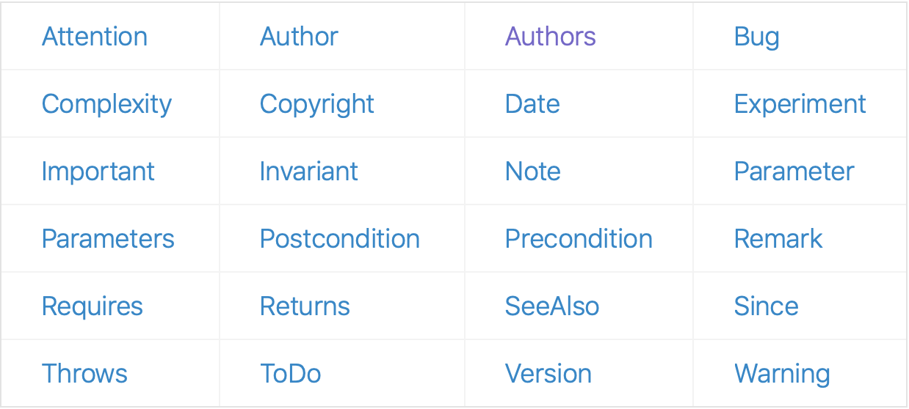
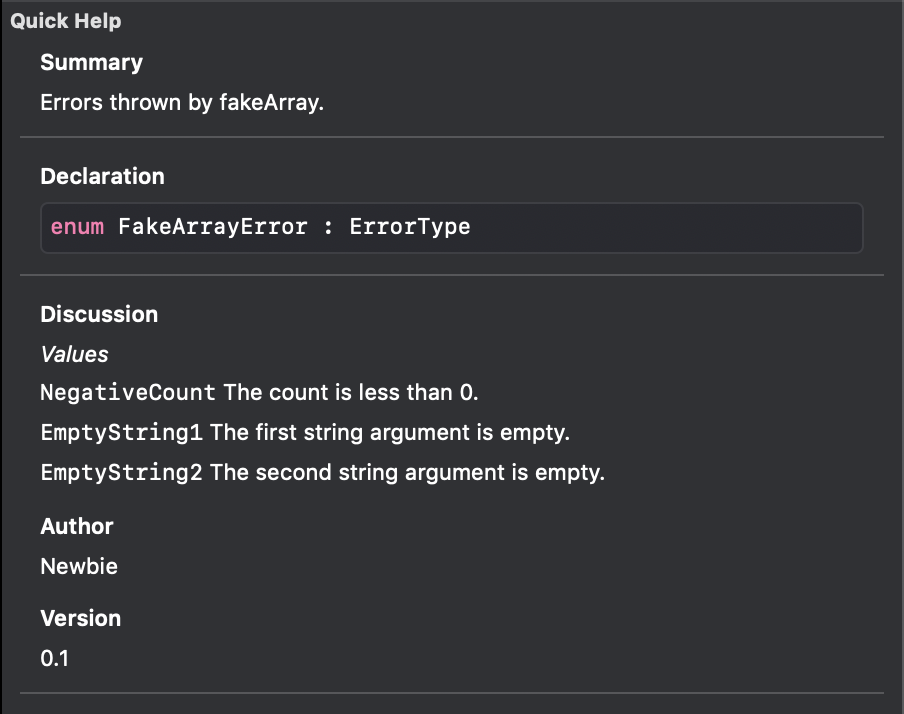
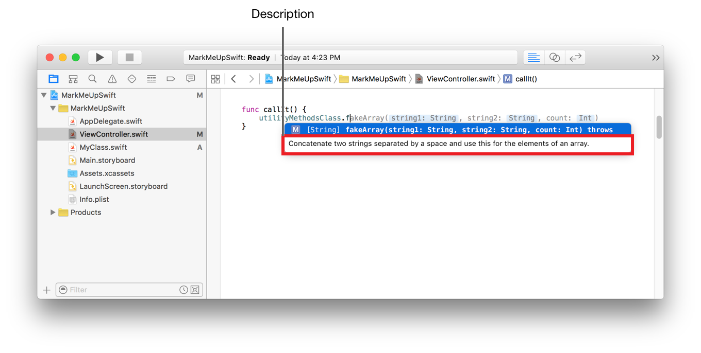
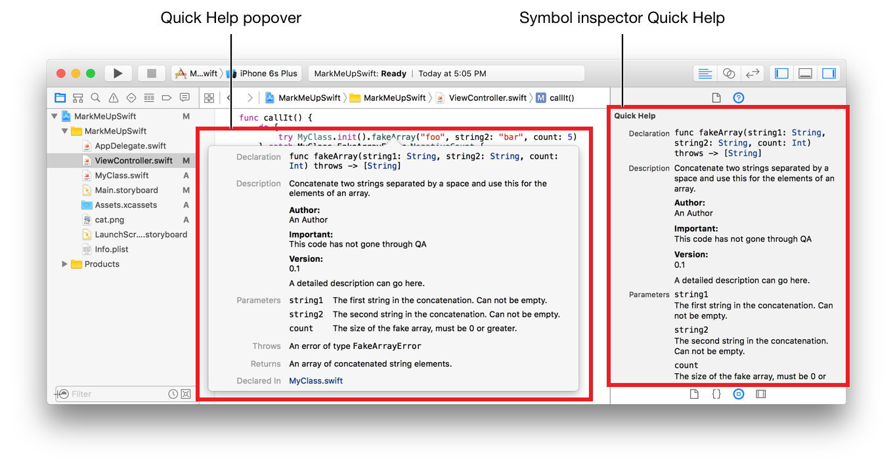

# Chapter 2. 스위프트 처음 시작하기

## 2.1 기본 명령 규칙
* 변수, 상수, 함수 메서드, 타입 등의 이름은 유니코드에서 지원하는 어떤 문자(한글, 한자, 영문, 숫자, 이모티콘, 등등)라도 사용할 수 있습니다. 다만 다음과 같은 예외 경우는 사용할 수 없습니다.

	* 스위프트에서 미리 정한 예약어 또는 키워드  
	* 해당 코드 범위 내에서 미리 사용되는 기존 이름과 동일한 이름 
	* 연산자로 사용될 수 있는 기호 (+,-,*,/)
	* 숫자로 시작하는 이름
	* 공백이 포함된 이름

* 함수, 메서드, 인스턴스 이름은 첫 글자를 소문자로 사용하는 Lower Camel Case를 사용합니다.
* 클래스, 구조체, 익스텐션, 프로토콜, 열거형 이름은 타입의 이름이기 때문에 첫 글자를 대문자로 사용하는 Upper Camel Case를 사용합니다.
* 대소문자를 구분합니다. 예를들어, Var과 var을 다르게 인식합니다.

> 애플은 스위프트 관련 문서 및 예제를 모두 스위프트의 [API 디자인 가이드라인](https://swift.org/documentation/api-design-guidelines/) 및 애플의  [코코아를 위한 코딩 가이드라인](https://developer.apple.com/library/archive/documentation/Cocoa/Conceptual/CodingGuidelines/Articles/NamingBasics.html)에 따라 작성했습니다. 

### 예약어와 키워드
예약어는 프로그래밍 언어에서 미리 사용하기로 약속한 단어로, 식별자로 사용할 수 없는 단어를 뜻합니다. 스위프트의 키워드는 대부분 예약어입니다. 일부 예약어의 경우에는 강세표(backquote, ')를 사용하여 이름으로 사용할 수 있습니다.

```swift
NOTE_ 
let var : String = "string" 코드에 대해 출력되는 오류 메시지
! 'var' cannot appear nested inside another 'var' or 'let pattern'
```


### 스위프트에서 세비콜론
* 스위프트에서 명령 구문 뒤에 세미콜론(;)을 붙이는 것은 선택사항입니다. 

## 2.2 콘솔 로그
프로그램에서 로그란 애플리케이션의 상태 또는 애플리케이션 내부 로직의 흐름을 관찰할 수 있도록 출력한 정보를 의미합니다. 콘솔 로그(Console Log)는 디버깅 중 디버깅 콘솔에 보여줄 로그를 뜻합니다. 스위프트에서는 print() 또는 dump() 함수를 사용하여 콘솔 로그를 출력할 수 있습니다.

### 2.2.1 print() 함수
* print() 함수는 로그를 출력한 뒤 줄바꿈을 해주기 위해 줄바꿈 문자(/n)를 자동으로 삽입해줍니다.
* print() 함수의 기본원형은 public func print(items: Any... , seperator: String = defualt, terminator: String = default)로 정의되어 있습니다.

### 2.2.2 print()와 dump()함수
print()함수는 출력하려는 인스턴스의 description property에 해당하는 내용을 출력해주고, dump()함수는 출력하려는 인스턴스의 자세한 내부 컨텐츠까지 출력해줍니다. 

```swift
EXAMPLE_

**예시 클래스 
class Abc {
    let a = "aa"
    let b = "bb"
}

-인스턴스 생성
let abc = Abc()

-print()로 출력했을 경우
App.Abc

-dump()로 출력했을 경우
App.Abc #0
- a: "aa"
- b: "bb"

** 예시 UI 선언부 
let view = UIView(frame: CGRect(x: 0, y: 0, width: 100, height: 100))

-print()로 출력했을 경우
<UIView: 0x108a0cde0; frame = (0 0; 100 100); layer = <CALayer: 0x159340cb0>>

-dump()로 출력했을 경우
- <UIView: 0x108a0cde0; frame = (0 0; 100 100); layer = <CALayer: 0x159340cb0>> #0
    - super: UIResponder
      - NSObject 

```
> [Example Reference](https://riptutorial.com/swift/example/25306/print---vs-dump--)

### 2.2.3 문자열 보간법
문자열 보간법(String Interpolation)은 변수 또는 상수 등의 값을 문자열 내에 나타내고 싶을 때 사용합니다. 문자열 내에 \(변수나 상수)의 형태로 표기하면 이를 문자열로 치환해서 넣습니다.

```swift
코드. 문자열 보간법 사용

let name: String = "yagom"
print("my name is \(name)")
```
## 2.3 주석
* 주석은 프로그램 소스 코드에 정보를 남기는 목적으로 사용합니다. 주로 코드를 다시 봤을 때 필요한 중요 메모나 다른 프로그래머에게 설명하기 위한 메모 등을 주석으로 남깁니다. 

* Xcode에는 말풍선의 형태로 레퍼런스 문서의 요약된 내용을 보여주는 퀵헬프라는 기능이 있습니다.
	* 퀵헬프를 보려면 퀵헬프를 보기 원하는 항목(변수, 상수, 함수, 메서드, 타입 등등) 위에 마우스 커서를 위치한 다음 키보드의 옵션키를 누른 상태로 클릭하면 됩니다.
	* 또는 킥헬프를 보기 원하는 항목에 커서를 위치한 다음 Quick Help Inspector(command + option + 2)를 통해 퀵헬프를 확인할 수도 있습니다.

### 한 줄 주석
* 한줄 주석은 슬래시 두개를 사용하여 나타냅니다.  
```swift
//한 줄 주석은 이렇게 표현됩니다.
```

### 여러 줄 주석
* 여러 줄 주석은 슬래시와 별표를 사용하여 나타냅니다.  

```swift
/*
여러 줄 주석을 시작할 때는 슬래시와 별표를 사용합니다.   
한 줄만 주석을 달아도 무방합니다.
*/
```

### 중첩 주석
* 스위프트에서는 여러줄 주석 안에 여러 줄 주석 또는 한 줄 주석을 넣는 중첩 주석을 지원합니다.
* 대부분의 프로그래밍 언어는 중첩주석을 지원하지 않습니다.  
```swift
/*여러 줄 주석 안쪽에
/* 추가로 여러 줄 주석을 포함할 수 있으며. 
// 그 안에 한줄 주석을 추가하여도 무방합니다.  
*/
이 부분도 주석처리 됩니다.  
*/
```

###  2.3.2 마크업 문법을 활용한 문서화 주석

마크업 문법을 활용해 주석을 작성하면 Xcode의 퀵헬프 기능을 통해 볼 수 있습니다. 문서화를 위한 한 줄 주석은 슬래시 세 개(`///`), 여러 줄 주석은 별표 두 개(`/**`, `*/`)를 사용합니다. 다음은 마크업 문법에 대한 간단한 설명입니다.

* 주석 첫 번째 줄에 작성되는 텍스트는 Description 부분에 표기됩니다.

  > :exclamation: 스위프트 5, Xcode 10을 기준으로는 Summary로 표시됩니다.

  > :star: 스위프트의 [API Design Guidelines](https://swift.org/documentation/api-design-guidelines/)에 따르면, 이 Summary와 Declaration을 통해서 API의 기능이 완전히 이해될 수 있도록 작성하는 것이 좋다고 합니다!

* `-`, `+`, `*`를 사용하여 원형 글머리 기호를 사용할 수 있고, 번호로 글머리 기호를 매길 수 있습니다.

* 기타 일반적인 마크다운 문법을 이용해 텍스트를 강조하거나, 코드 블록을 만들거나, 제목을 표시할 수 있습니다.

* 다음 키워드들을 통해 적절한 정보를 제공할 수 있습니다.

  

  각 delimeter에 관한 더 자세한 사항은 [Markup Functionality]()를 참조하세요.


마크업 문법을 따른 간단한 주석 예시입니다.

```swift
/**
 Errors thrown by fakeArray.
 
 *Values*
 
 `NegativeCount` The count is less than 0.
 
 `EmptyString1` The first string argument is empty.
 
 `EmptyString2` The second string argument is empty.
 
 - Author:
 Newbie
 - Version:
 0.1
 */

enum FakeArrayError: ErrorType {...
```


위 주석을 퀵헬프를 통해 확인하면 다음과 같이 나타납니다(스위프트 5, Xcode 10 기준).

  


이처럼 마크업 문법을 따라 작성된 주석은 다음 항목들에서 확인할 수 있습니다.

* Symbol Completion(자동완성) 제안 시 해당 항목에 대한 Description

  

* Quick Help Inspector 및 Quick Help Popover

  

## 2.4 변수와 상수

변수는 생성 후 데이터값을 변경할 수 있지만, 상수는 한번 값을 설정하면 다음에 변경할 수 없습니다.


### 2.4.1 변수

`var` 키워드를 이용해 변수를 생성합니다. `var [변수명]: [데이터 타입] = [값]` 형태로 선언합니다.

> :exclamation: 데이터 타입을 생략하면 컴파일러가 타입을 추론하여 타입을 지정하지만, 이 기능은 스위프트에 많이 익숙해졌을 때 사용하길 권합니다.

변수 선언 및 사용 예를 나타낸 코드입니다.

```swift
var name: String = "yagom"

print("저의 이름은 \(name)입니다.")
```


### 2.4.2 상수

`let` 키워드를 이용해 상수를 생성합니다. `let [변수명]: [데이터 타입] = [값]` 형태로 선언합니다. 변수 선언과 마찬가지로 데이터 타입을 생략하여 타입 추론 기능을 이용할 수 있습니다.

상수 선언 및 사용 예를 나타낸 코드입니다.

```swift
let name: String = "yagom"

name = "야곰" // 상수로 선언된 값은 변경할 수 없습니다. 컴파일 오류가 발생합니다.
```

> :exclamation: 상수로 값을 선언하면, 이후 코드에서 값의 변화가 없다는 사실을 직관적으로 알 수 있습니다.


---

이미지 출처

* [API Design Guidelines](https://swift.org/documentation/api-design-guidelines/)

* [Markup Formatting Reference](https://developer.apple.com/library/archive/documentation/Xcode/Reference/xcode_markup_formatting_ref/index.html#//apple_ref/doc/uid/TP40016497-CH2-SW1)