# Chapter 03. 데이터 타입 기본

- **데이터 타입**이란 프로그램 내에서 다뤄지는 데이터의 종류를 뜻한다.
- 스위프트의 기본 **데이터 타입**은 모두 **구조체([struct](https://docs.swift.org/swift-book/LanguageGuide/ClassesAndStructures.html))** 를 타입의 기반으로 삼고있다.
  - **구조체(struct)** 에 대한 자세할 설명은 **[CHAPTER9](./../CHAPTER09/README.md)**.
- 모든 데이터 타입 이름은 첫 글자가 대문자로 시작하는 **대문자 카멜케이스(Upper Camel Case)**

## 3.1 Int와 UInt
- **정수** 타입 이다.
- **Int**은 +, - 부호를 포함한 정수를 뜻한다.
- **UInt**은 0을 포함한 양의 정수를 뜻한다.
- 8비트, 16비트, 32비트, 64비트의 크기 형태가 존재하며 **min, max** 프로퍼티를 이용하여 타입의 표현 범위를 알 수 있다.
  - **8비트** - Int8, UInt8
  - **16비트** - Int16, UInt16
  - **32비트** - Int32, UInt32
  - **64비트** - Int64, UInt64
***
### 데이터 타입의 크기를 출력하는 코드
```swift
print("----------Int 타입 종류----------")
print("Int.min : \(Int.min)")
print("Int.max : \(Int.max)")
print("------------------------------")
print("Int8.min : \(Int8.min)")
print("Int8.max : \(Int8.max)")
print("Int16.min : \(Int16.min)")
print("Int16.max : \(Int16.max)")
print("Int32.min : \(Int32.min)")
print("Int32.max : \(Int32.max)")
print("Int64.min : \(Int64.min)")
print("Int64.max : \(Int64.max)")
print() // 가독성을 위하여 \n 대신 프린트 한번 더 호출
print("----------UInt 타입 종류----------")
print("Int.min : \(UInt.min)")
print("Int.max : \(UInt.max)")
print("------------------------------")
print("Int8.min : \(UInt8.min)")
print("Int8.max : \(UInt8.max)")
print("Int16.min : \(UInt16.min)")
print("Int16.max : \(UInt16.max)")
print("Int32.min : \(UInt32.min)")
print("Int32.max : \(UInt32.max)")
print("Int64.min : \(UInt64.min)")
print("Int64.max : \(UInt64.max)")
```

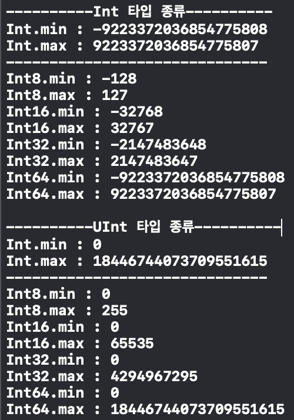<br/>

***
- **Int**와 **UInt**는 **[시스템 아키텍처(WORD단위)](https://ko.wikipedia.org/wiki/%EC%9B%8C%EB%93%9C_(%EC%BB%B4%ED%93%A8%ED%8C%85))** 에 따라 달라진다. 32비트 아키텍처에서는 **Int32가 Int**, **UInt32가 UInt**로 자동 지정된다. 마찬가지로 64비트 아키텍처에서는 **Int64가 Int**, **UInt64가 UInt**로 지정된다.
- 스위프트 언어는 타입에 **굉장히 엄격(근엄, 진지)** 하다. Int와 UInt를 **완전히 다른 타입**으로 인식한다.

***
### 타입에 엄격함을 보여주는 예시 코드
- **UInt에 음수를 대입하는 행위**

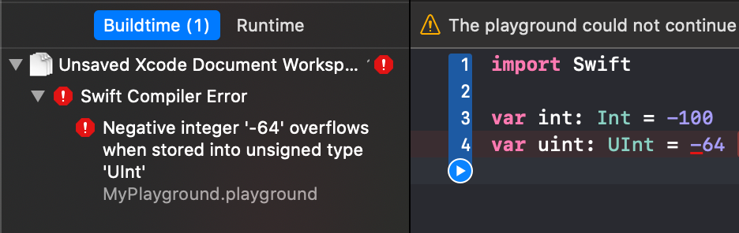<br/>
표현하는 범위를 벗어났기 때문에 컴파일러에서 에러가 발생한다.

```swift
// 옳은 표현이 없다.
```

- **UInt에 Int를 대입하는 행위**

<br/>
표현하는 범위안에 있지만 Int와 UInt의 데이터 타입이 다르기때문에 암묵적인 타입 캐스팅이 이루어지지 않고 컴파일러에서 에러가 발생한다.

```swift
// 옳은 표현
let int: Int = 64
let uint: UInt = UInt(int)

// More TIP
// 밑과 같은 표현은 잘못된 표현이다.
// 컴파일 에러는 뜨지 않지만 런타임 에러로 프로그램이 죽는다.
/*
let int: Int = -64
let uint: UInt = UInt(int)
*/
```

- **Int64에 Int를 대입하는 행위**

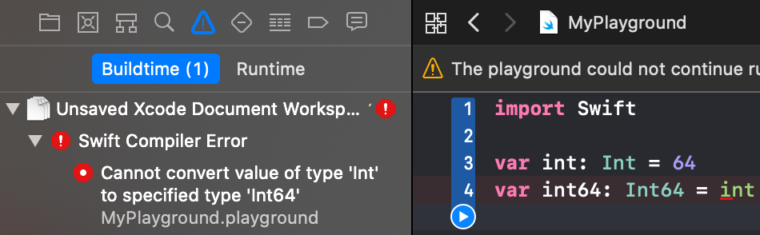<br/>
표현하고자 하는 범위안에 있고 위에 설명과 같이 64비트 아키텍처에서 범위 출력 결과 같은 데이터 크기임을 확인 하였으나 스위프트상에서 Int와 Int64를 다른 타입으로 취급한다.

```swift
// 옳은 표현
let int: Int = 64
let int64: Int64 = Int64(int)
```

- **데이터 타입의 범위를 초과하는 행위**

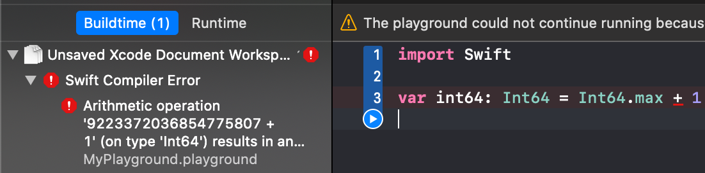<br/>
데이터 타입의 **`max + 1`** 또는 **`min - 1`** 코드는 컴파일 에러를 발생하고 **max** 또는 **min**을 대입 후 **범위를 초과**하는 계산식을 사용시 런타임 에러가 난다.
***

- 각 진수별 정수 표현
  - **10진수**: 평소에 표현 하던 숫자와 동일하게 작성하면 된다.
  - **2진수**: **접두어(prefix)** 에 **`0b`** 를 사용하여 표현한다.
  - **8진수**: **접두어(prefix)** 에 **`0o`** 를 사용하여 표현한다.
  - **16진수**: **접두어(prefix)** 에 **`0x`** 를 사용하여 표현한다.
### 진수별 정수 표현 코드
```swift
let decInt: Int = 64
let binInt: Int = 0b1000000
let octInt: Int = 0o100
let hexInt: Int = 0x40
```
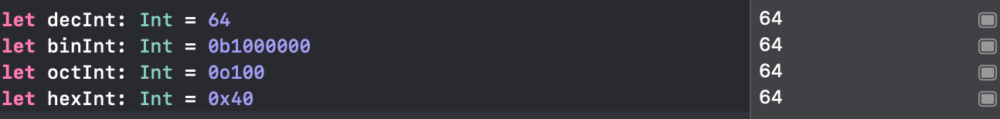<br/>

## 3.2 Bool
- 불리언 타입이다.
- 참(true) 또는 거짓(false)만 값으로 가집니다.
### 예제 코드
```swift
let bool: Bool = true
let holly: Bool = true
let 이잉앗살라말라이쿰: Bool = false

print("압둘알리 과로사 입니까? \(이잉앗살라말라이쿰)")
```
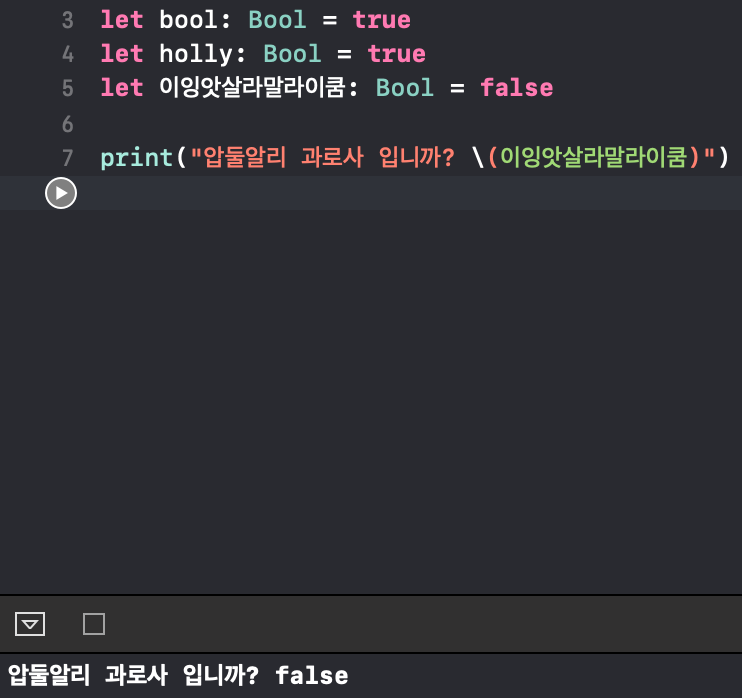<br/>

## 3.3 Float과 Double
- 부동소수점을 사용하는 **실수**며 부동소수 타입이라고 한다.
- 스위프트에서는 64비트 부동소수 표현을 하는 **Double**과 32비트 부동소수 표현을 하는 **Float**이 있다.
- 64비트 환경에서 Double은 최소 15자리 십진수를 표현, Float은 6자리의 숫자까지만 표현이 가능하다.
- 같을 값을 입력하더라도 Float과 Double은 값을 표현하는 방식에서 정확도 차이가 있다.
### 예제 코드 
```swift
// Float이 수용할 수 있는 범위를 넘어섭니다.
// 자신이 감당할 수 있는 만큼만 남기므로 정확도가 떨어집니다.
var floatVal: Float = 1234567890.1

// Double은 충분히 수용할 수 있습니다.
var doubleVal: Double = 1234567890.1

print("floatVal : \(floatVal), doubleVal : \(doubleVal)")

// 수용 가능한 값으로 변경
floatVal = 123456.1

print(floatVal)

// 실수 타입은 태생적으로 표현하는 방법으로 인해
// 정확도의 한계를 보여준다.
// 정확도의 한계를 보여주는 간단한 예제
floatVal = 0
doubleVal = 0
for _ in 1...10 {
    floatVal += 0.1
    doubleVal += 0.1
}

print("floatVal : \(floatVal), doubleVal : \(doubleVal)")
```

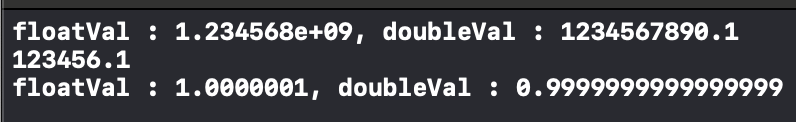<br/>

- Float타입또한 32비트 64비트 80비트크기의 형태가 존재한다
  - **32비트** - Float32
  - **64비트** - Float64
  - **80비트** - Float80
### 추가적인 데이터 타입에 대한 출력 예제코드
```swift
// Float32는 Float과 마찬가지로 32비트의 크기를 가지고 있으며
// Float과 같은 정확도를 가지기 때문에 숫자가 짤린다.
var float32: Float32 = 1234567890.1

// Float64는 Double과 같기 때문에 표현이 된다.
var float64: Float64 = 1234567890.1

print("float32 : \(float32), float64 : \(float64)")

// 이번엔 Float64(Double)도 감당할 수 없을 정도의 값을 입력
// 감당을 할 수 없기때문에 마찬가지로 숫자가 짤린다.
float64 = 12345678901234567890.1

// 하지만 80비트(10바이트)를 자랑하는 Float80은 충분히 다 담아내는 것을 볼 수 있다.
let float80: Float80 = 12345678901234567890.1
print("float64 : \(float64), float80 : \(float80)")
```

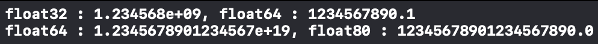<br/>

- 부동소숫값을 콘솔로그에 촐력해보면 우리가 평소에 볼 수 있는 10진수 표현이 아닌 다른 표현이 보이는 경우가 있다. 10진수로 표현할 수 있는 한계를 넘어 지수로 표현된 값이며 우리가 반대로 해당 표현을 사용해서 값을 넣어줄 수 있습니다.
```swift
// 지수로 표현
// 123.0을 표현한 것 입니다.
print(1.23E2) // 1.23 * 10²과 같은 값이다

// 쉬운 예
// 1.23E2는 1.23에
// 10을 두번 (== E2) 곱한것과 같은 표현.
print(1.23 * (10 * 10))

// 반대로 마이너스는
// 123.0에
// 10을 두번 (== E-2) 나눈것과 같은 표현.
print(123.0E-2) // 1.23 * 10⁻²과 같은 값이다
print(123.0 / (10 * 10))

// 간단하게 이야기하자면 자릿수를 숫자만큼 밀면된다.

// 0xAp2는 비트 단위로 생각했을때 자릿수를 미는것과 같다.
print(0xAp2) // 0xA * 2²과 같은 값이다.

// 비트 단위로 생각했을때 자릿수를 미는것과 같다라는 의미의 예시.
// 하지만 개념만 비슷한거고 쉬프트연산자와 16진수의 부동소수점 표현이랑은 다른 것이다.
print(0xA << 2)

print(0xAp-2) // 0xA * 2⁻²과 같은 값이다.
```

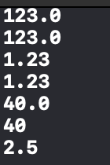<br/>


## 3.4 Character
- 말 그대로 **문자**를 의미한다. 단어, 문장처럼 문자의 집합이 아니라 단 하나의 문자를 의미한다.
- 스위프트는 기본적으로 유니코드 9 문자를 사용하므로 영어는 물론 유니코드 9 기준으로 지원하는 것들을 모두 지원합니다.
- 문자다 라는 것을 표현하기 위해서는 큰 따옴표를 사용합니다.

```swift
// 특수문자로 인식하는 것과 유니코드의 문자라고 인식하는 것의 차이를 보인다
// let ♦: Character = "♦︎" 이런식의 표현은 에러를 발생한다.
// 특수문자로 인식하는 것은 에러가 뜨고
// 이모지(유니코드9 기준으로 생긴 문자 테이블 중 하나.)로 인식하는 것은 
// 변수로써 사용 가능하다
let char: Character = "A"
let diamond: Character = "♦︎"
let 🐶: Character = "🐶"
let 🙈: Character = "🙈"
let 이거슨수류탄이여: Character = "탄"
``` 

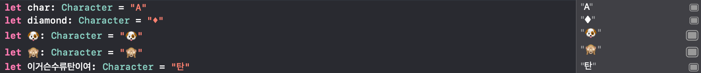<br/>

- [스위프트 가이드 베이직](https://docs.swift.org/swift-book/LanguageGuide/TheBasics.html)에 확인을 해보면 선언이 가능한 것에 대한 설명이 나와있다.
- [유니코드 위키피디아](https://ko.wikipedia.org/wiki/%EC%9C%A0%EB%8B%88%EC%BD%94%EB%93%9C#cite_note-24)에 버전부분을 확인해보면 9기준으로 이모지를 지원한다.

## 3.5 String
- 문자의 나열또는 문자 배열이라고 해서 문자열 이라고한다.
- Character와 마찬가지로 유니코드 9(스위프트에서 기본적으로 지원하기때문)을 지원한다.
### 예제코드
```swift
// 상수로 선언된 문자열은 변경이 불가능하다.
let constant: String = "상수상수"

// 이니셜라이저를 통해 빈 문자열을 생성할 수 있다
// 변수로 선언했기 때문에 수정 변경 쌉가능.
var variable: String = String()
// var variable: String = ""
// var variable = ""
// 와 같은 표현이다.

variable = "Hello "

//append 메소드를 사용하여 문자열을 이어붙일 수 있다.
variable.append("World")
print(variable)

// + 연산자를 통해서도 문자열을 이어 붙일수 있다.
variable = variable + " " + constant + "와 변수의 합작"
print(variable)

// count 프로퍼티로 문자의 수를 셀 수 있습니다.
print("문자열에 글자 수: \(variable.count)") // 24

// 빈 문자열인지 확인해볼 수 있습니다.
print("문자열에 글자 수: \(variable.isEmpty)") // false

// 유니코드의 스칼라값을 사용하면 값에 해당하는 표현이 출력됩니다.
variable = "\u{2665}"
print(variable) // ♥

// 그외 추가
var string: String = ""

string += "Hello"
string += " "
string += "World"

print(string) // Hello World

let hello = "Hello"

// 문자열 비교
print("hello == \"Hello\" : \(hello == "Hello")") // true
print("hello == \"hello\" : \(hello == "hello")") // false
print("hello == string : \(hello == string)") // false

// 접두사와 접미사를 확인하는 용도의 메서드
print("hello.hasPrefix(\"He\") : \(hello.hasPrefix("He"))") // true
print("hello.hasPrefix(\"he\") : \(hello.hasPrefix("he"))") // false
print("hello.hasPrefix(\"el\") : \(hello.hasPrefix("el"))") // false

print("hello.hasSuffix(\"ello\") : \(hello.hasSuffix("ello"))") // true
print("hello.hasSuffix(\"He\") : \(hello.hasSuffix("He"))") // false
print("hello.hasSuffix(\"ell\") : \(hello.hasSuffix("ell"))") // false

// 대문자와 소문자로 바꿔주는 메서드
print("\"heLLo\".uppercased() : \("heLLo".uppercased())")
print("\"WoRlD\".lowercased() : \("WoRlD".lowercased())")

// 한번에 여러줄을 쓰는 방법
print("""
안녕하세요 정말 신기 하지 않습니까? "Hello World"
이런식으로 한번에 여러줄을 작성하는 것이 가능합니다.
문자열 보간법도 가능하죠. 1 + 1 = \(1 + 1)
이런식으로 큰따옴표 두개를 연달아 쓸수 있습니다. ""
하지만 세개를 연달아 쓰면 여러줄을 쓴다는 것에 대해 끝을 알리는 것이므로
이렇게 쓰셔야합니다 \\\""" 또는 \\"\\"\\"
실제로 작성 했을 때 결과. \""" (\\\""")와 \"\"\" (\\"\\"\\")
""")

// 하지만 위와 같이 쓰면 실수를 하기 마련이죠.
// 좀더 멋진 방법을 알아볼까요?
print(#"""
이런식의 작성으로 위와 같은여러줄을 쓸수 있는 효과를 주면서
큰따옴표를 연속적으로 쓰는 것이 \""" 이런식의 표현으로 쓸 필요가 사라집니다.
표현하는 부분에서 자유로워 집니다. """자"""유"""
"""#)
```

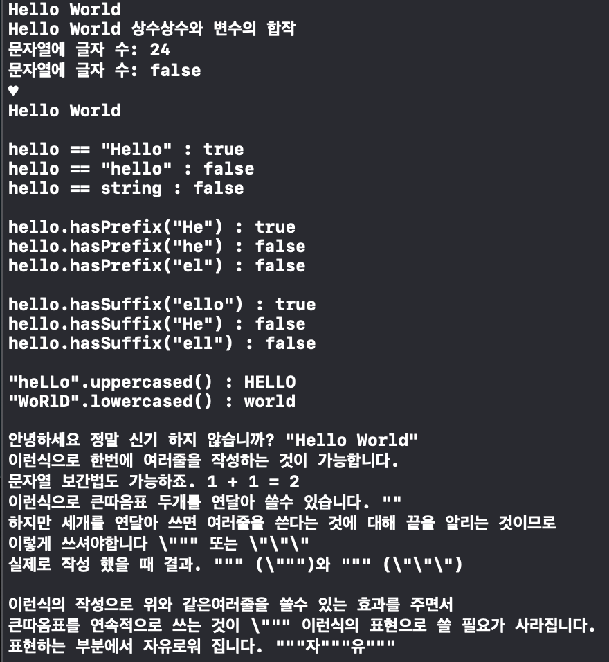<br/>

- [스위프트 문자열과 문자](https://docs.swift.org/swift-book/LanguageGuide/StringsAndCharacters.html) 부분에서 일부 참고하여 추가적으로 코드를 작성했습니다.

### 3.5.1 특수문자
스위프트에서 문자열 내에서 일정 기능을 하는 특수문자(제어문자)가 있는데 실질적으로 문자로써 활용하기 위한 표현법은 모두 백슬래시에 특정한 문자를 조합하여 사용가능합니다.

|특수문자|설명|
|-|-|
|`\n`|줄바꿈 문자|
|`\\`|문자열 내에서 백슬래시를 표현하고자 할 때 사용|
|`\"`|문자열 내에서 큰따옴표를 표현하고자 할 때 사용|
|`\t`|탭 문자. 키보드의 탭키를 눌렀을 때와 같은 효과|
|`\0`|문자열이 끝났음을 알리는 null 문자|

### 예시코드
```swift
print("실제 예시\n\"큰따옴표\"를 사용하고 \t를 사용하여 띄우고 \"\\\"이러한 것들을 표현가능합니다.")
```

<br/>

## 3.6 Any, AnyObject와 nil
- Any는 모든 데이터를 담을 수 있다.
- AnyObject는 Any와 다르게 레퍼런스 타입만 넣을 수 있으며 즉 [클래스](./../CHAPTER09/README.md)의 인스턴스만 담을 수 있다.
### 예제코드
```swift
var `var`: Any = "Hello Any"
`var` = 123
`var` = 1.23
```
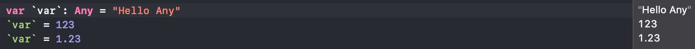<br/>

- Any와 AnyObject는 될 수 있으면 사용하지 않는 것이 좋습니다. 타입이 엄격한 스위프트 특성상 변수의 값을 계산이외 여러가지 메소드에 인자로 넣는 등 하는 부분에서 매번 타입을 확인 및 변환해야 하기 때문에 불편하기도 하지만 예기치 못한 오류의 위험을 증가시키기 때문입니다.
- `nil`은 특정 타입이 아니라 **'없음'** 을 나타내는 스위프트 키워드입니다. 즉 변수 또는 상수 값이 들어있지 않고 비어있음을 나타내는 데 사용합니다. `nil`을 계산이나 어떠한 형태로 변수든 상수든 접근시 런타임 오류가 발생합니다. 잘못된 메모리에 접근하여 발생하는 런타임 오류 널 포인트 익셉션(Null Point Exception)이라고 불리는 상황에서 대해서는 [옵셔널](./../CHAPTER08/README.md)에서 다뤄보도록 하겠습니다.
- 그외 특정 함수의 반환 타입으로 사용될 수 있는 Never라는 타입이 있습니다. Never에 대해서는 종료되지 않는 [함수](./../CHAPTER07/README.md)에서 다루겠습니다.

## 3.x 여담
- 데이터 타입의 부호 비트에 대한 글 **[[참고링크]](https://ko.wikipedia.org/wiki/Signed%EC%99%80_unsigned)** **[[참고링크2]](https://ko.wikipedia.org/wiki/%EC%B5%9C%EC%83%81%EC%9C%84_%EB%B9%84%ED%8A%B8)**
- Float, Double 타입의 대한 구조 **[[참고링크]](https://en.wikipedia.org/wiki/Single-precision_floating-point_format)** **[[참고링크(한국어)]](https://ko.wikipedia.org/wiki/%EB%B6%80%EB%8F%99%EC%86%8C%EC%88%98%EC%A0%90)**
- FloatingPoint(Numeric Protocols) 맛보기
```kotlin
// 제네릭으로 타입을 받지만 해당 타입에 대해서 실수형으로만 받고자
// 하면서 동시에 실수형의 연산과 메서드를 사용 하기 위해
// FloatingPoint로 제약을 걸어준다.
func 피타형님정리<T: FloatingPoint>(_ a : T,_ b : T) {
    print("√(밑변제곱+높이제곱) = \((a*a + b*b).squareRoot())(빗변)")
}

피타형님정리(3.0, 4.0)
```

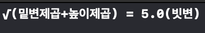<br/>

- 그외 Numeric Protocols에 대한 종류 **[[참고링크]](https://developer.apple.com/documentation/swift/swift_standard_library/numbers_and_basic_values/numeric_protocols)**
