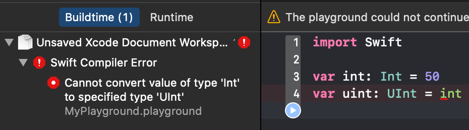

# Chapter 03. 데이터 타입 기본

- **데이터 타입**이란 프로그램 내에서 다뤄지는 데이터의 종류를 뜻한다.
- 스위프트의 기본 **데이터 타입**은 모두 **구조체([struct](https://docs.swift.org/swift-book/LanguageGuide/ClassesAndStructures.html))** 를 타입의 기반으로 삼고있다.
  - **구조체(struct)** 에 대한 자세할 설명은 **[CHAPTER9](./../CHAPTER09/README.md)**.
- 모든 데이터 타입 이름은 첫 글자가 대문자로 시작하는 **대문자 카멜케이스(Upper Camel Case)**

## 3.1 Int와 UInt
- **정수** 타입 이다.
- **Int**은 +, - 부호를 포함한 정수를 뜻한다.
- **UInt**은 0을 포함한 양의 정수를 뜻한다.
- 8비트, 16비트, 32비트, 64비트의 크기 형태가 존재하며 **min, max** 프로퍼티를 이용하여 타입의 표현 범위를 알 수 있다.
  - **8비트** - Int8, UInt8
  - **16비트** - Int16, UInt16
  - **32비트** - Int32, UInt32
  - **64비트** - Int64, UInt64
***
### 데이터 타입의 크기를 출력하는 코드
```swift
print("----------Int 타입 종류----------")
print("Int.min : \(Int.min)")
print("Int.max : \(Int.max)")
print("------------------------------")
print("Int8.min : \(Int8.min)")
print("Int8.max : \(Int8.max)")
print("Int16.min : \(Int16.min)")
print("Int16.max : \(Int16.max)")
print("Int32.min : \(Int32.min)")
print("Int32.max : \(Int32.max)")
print("Int64.min : \(Int64.min)")
print("Int64.max : \(Int64.max)")
print() // 가독성을 위하여 \n 대신 프린트 한번 더 호출
print("----------UInt 타입 종류----------")
print("Int.min : \(UInt.min)")
print("Int.max : \(UInt.max)")
print("------------------------------")
print("Int8.min : \(UInt8.min)")
print("Int8.max : \(UInt8.max)")
print("Int16.min : \(UInt16.min)")
print("Int16.max : \(UInt16.max)")
print("Int32.min : \(UInt32.min)")
print("Int32.max : \(UInt32.max)")
print("Int64.min : \(UInt64.min)")
print("Int64.max : \(UInt64.max)")
```

### **결과**

<br/>

***
- **Int**와 **UInt**는 **[시스템 아키텍처(WORD단위)](https://ko.wikipedia.org/wiki/%EC%9B%8C%EB%93%9C_(%EC%BB%B4%ED%93%A8%ED%8C%85))** 에 따라 달라진다. 32비트 아키텍처에서는 **Int32가 Int**, **UInt32가 UInt**로 자동 지정된다. 마찬가지로 64비트 아키텍처에서는 **Int64가 Int**, **UInt64가 UInt**로 지정된다.
- 스위프트 언어는 타입에 **굉장히 엄격(근엄, 진지)** 하다. Int와 UInt를 **완전히 다른 타입**으로 인식한다.

***
### 타입에 엄격함을 보여주는 예시 코드
- **UInt에 음수를 대입하는 행위**
<br/>
표현하는 범위를 벗어났기 때문에 컴파일러에서 에러가 발생한다.

```swift
// 옳은 표현이 없다.
```

- **UInt에 Int를 대입하는 행위**
<br/>
표현하는 범위안에 있지만 Int와 UInt의 데이터 타입이 다르기때문에 암묵적인 타입 캐스팅이 이루어지지 않고 컴파일러에서 에러가 발생한다.

```swift
// 옳은 표현
let int: Int = 64
let uint: UInt = UInt(int)

// More TIP
// 밑과 같은 표현은 잘못된 표현이다.
// 컴파일 에러는 뜨지 않지만 런타임 에러로 프로그램이 죽는다.
/*
let int: Int = -64
let uint: UInt = UInt(int)
*/
```

- **Int64에 Int를 대입하는 행위**
<br/>
표현하고자 하는 범위안에 있고 위에 설명과 같이 64비트 아키텍처에서 범위 출력 결과 같은 데이터 크기임을 확인 하였으나 스위프트상에서 Int와 Int64를 다른 타입으로 취급한다.

```swift
// 옳은 표현
let int: Int = 64
let int64: Int64 = Int64(int)
```

- **데이터 타입의 범위를 초과하는 행위**
<br/>
데이터 타입의 **`max + 1`** 또는 **`min - 1`** 코드는 컴파일 에러를 발생하고 **max** 또는 **min**을 대입 후 **범위를 초과**하는 계산식을 사용시 런타임 에러가 난다.
***

- 각 진수별 정수 표현
  - **10진수**: 평소에 표현 하던 숫자와 동일하게 작성하면 된다.
  - **2진수**: **접두어(prefix)** 에 **`0b`** 를 사용하여 표현한다.
  - **8진수**: **접두어(prefix)** 에 **`0o`** 를 사용하여 표현한다.
  - **16진수**: **접두어(prefix)** 에 **`0x`** 를 사용하여 표현한다.
### 진수별 정수 표현 코드
```swift
let decInt: Int = 64
let binInt: Int = 0b1000000
let octInt: Int = 0o100
let hexInt: Int = 0x40
```
<br/>

## 3.2 Bool
- 불리언 타입이다.
- 참(true) 또는 거짓(flase)만 값으로 가집니다.
### 예제 코드
```swift
let bool: Bool = true
let holly: Bool = true
let 이잉앗살라말라이쿰: Bool = false

print("압둘알리 과로사 입니까? \(이잉앗살라말라이쿰)")
```
<br/>

## 3.3 Float과 Double

## 3.4 Character

## 3.5 String

### 3.5.1 특수문자

## 3.6 Any, AnyObject와 nil

## 3.x 여담
- 데이터 타입의 부호 비트에 대한 글 **[[참고링크]](https://ko.wikipedia.org/wiki/Signed%EC%99%80_unsigned)** **[[참고링크2]](https://ko.wikipedia.org/wiki/%EC%B5%9C%EC%83%81%EC%9C%84_%EB%B9%84%ED%8A%B8)**
- Float, Double 타입의 대한 구조 **[[참고링크]](https://en.wikipedia.org/wiki/Single-precision_floating-point_format)**