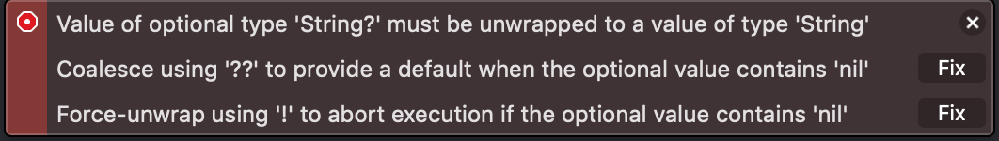
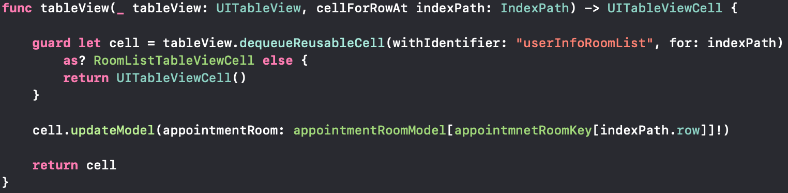
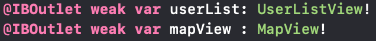

# CHAPTER 08 옵셔널 

## 8.1 옵셔널 사용

## 8.2 옵셔널 추출

* 열거형의 some 케이스로 꼭꼭 숨어 있는 옵셔널의 값을 옵셔널이 아닌 값으로 추출하는 옵셔널 추출하는 방법
### 8.2.1 강제 추출
* 옵셔널 강제 추출 방식 :  옵셔널의 값을 가장 간단하지만 가장 위험한 방법
* 옵셔널 값의 뒤에 '!'를 붙여주면 값을 강제로 추출하여 반환해줌
* 강제 추출시 옵셔널에 값이 없다면, 런타인 오류 발생
```swift
var name: String? = "Jakyung"

var jayjay: String = name!
print(\(jayjay))
// Jakyung

name = nil
jayjay = name! // 런타임 오류 남
```


### 8.2.2 옵셔널 바인딩
* 옵셔널 바인딩 : 옵셔널에 값이 있다면 옵셔널에서 추출한 값을 일정 블록 안에서 사용할 수 있는 상수나 변수로 할당해서 옵셔널이 아닌 형태로 사용할 수 있도록 해줌
* if or while문 등과 결합하여 사용/ guard를 사용
```swift
// if문 옵셔널 바인딩
var name: String? = "Jakyung"
if let jay = name {
    print("name is \(jay)")
} else {
    print("name is nil")
}
// name is Jakyung

if var jay = name {
    jay = "Jay"
    print("name is \(jay)")
} else {
    print("name is nil")
}
// name is Jay

// ??을 이용한 옵셔널 바인딩
let jay = name ?? "nil"

// guard를 이용한 옵셔널 바인딩
guard let name = jay else {return}
```
* guard sample : tableView cell 지정


* 옵셔널 바인딩을 통해 한번에 여러 옵셔널의 값을 추출할 수 있음.
* 쉼표(,)를 사용해 바인딩 할 옵셔널을 나열하면 됩니다.
* 단, 바인딩 하려는 옵셔널 중 하나라도 값이 없다면 해당 블록 내부의 명령문은 실행 되지 않음
```swift
var name: String? = "Jakyung"
var friend: String? = nil

if let jay = name, let hasFriend = friend {
    print("\(jay), \(hasFriend)")
} else {
    print("\(jay) has no friend")
}
// Jakyung has no friend

friend = "퓨뜸띠"

if let jay = name, let hasFriend = friend {
    print("\(jay) & \(hasFriend) is friend")
} else {
    print("\(jay) has no friend")
}
// Jakyung & 퓨뜸띠 is friend
```

### 8.2.3 암시적 추출 옵셔널
* 암시적 추출 옵셔널 : 타입 뒤에 '!'를 사용
* 옵셔널 바인딩 추출 귀찮, 로직상 nil때문에 런타임 오류가 발생하지 않을 것 같다는 확신이 들때 사용
```swift
var name: String! = "Jakyung"
print(\(name)) // Jakyung

name = nil

//암시적 추출 옵셔널도 옵셔널이므로 바인딩을 사용할 수 있음
if var jay = name {
    print("not nil")
} else {
    print("is nil")
}
// is nil

name.isEmpty //error
```
* viewController에 view를 지정을 할 때 사용

