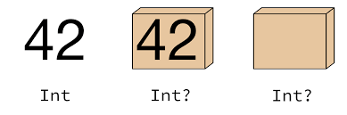

# CHAPTER 08 옵셔널 

옵셔널의 개념은 다음과 같다.

* '변수나 상수 등에 꼭 값이 있다는 것을 보장할 수 없다, 즉 변수 또는 상수의 값이 nil일 수도 있다'는 것을 의미

* 또한 'Optional이 아닌 변수나 상수는 값이 반드시 있다는 것을 보장한다'는 의미

* 어떤 함수의 전달인자로 NULL이 전달되어도 되는지를 문서에 명시하지 않아도 문법적 표현만으로 이를 표현할 수 있다는 장점

  

  위 이미지는 Dictionary에서 키를 이용해 인덱스를 찾는 메서드의 API 문서이다. key 매개변수를 통해 전달되는 인자는 nil이어서는 안되고, 리턴값은 nil일 수도 있음을 직관적으로 알려준다.

* **옵셔널과 옵셔널이 아닌 값은 다른 타입으로 인식**하기 때문에 컴파일할 때 바로 오류를 걸러낼 수도 있음

> NULL을 스위프트에서는 nil로 표기한다.


## 8.1 옵셔널 사용

변수 또는 상수에 값이 없을 때 nil로 표현하며, 옵셔널 변수 또는 상수에만 nil을 할당할 수 있다.

값이 없는 옵셔널 변수 또는 상수에 접근하려 하면 런타임 오류가 발생한다.

```swift
var myName: String = "Chaewan"
myName = nil // 오류 발생
```

데이터 타입 뒤에 물음표 `?`를 붙여 옵셔널 변수 또는 상수를 선언한다.

```swift
var myName: String? = "Chaewan"
myName = nil
```

옵셔널은 다음과 같은 상황에서 사용한다.

- 함수 내부에서 제대로 처리하지 못했음을 nil을 반환하여 오류 표현
- 매개변수를 굳이 넘기지 않아도 된다는 뜻으로 매개변수의 타입을 옵셔널로 정의

옵셔널은 제네릭이 적용된 열거형으로 구현되어 있으며, ExpressibleByNilLiteral 프로토콜을 따른다. 또한 옵셔널은 값을 갖는 케이스와 그렇지 못한 케이스 두 가지로 정의되어 있으며, 값이 nil일 때는 none 케이스가 되고, 값이 있는 경우는 some 케이스가 되면서 연관 값인 Wrapped에 값이 할당된다.

```
public enum Optional<Wrapped> : ExpressibleByNilLiteral {
    case none
    case some(Wrapped)

    public init(_ some: Wrapped)
    /// 중략...
}
```

이처럼 옵셔널 타입은, 다음 그림과 같이 실제 값이 옵셔널이라는 열거형의 방패막에 보호되어 래핑되어 있는 형태이다.



옵셔널은 열거형이기 때문에 switch 구문을 통해 값이 있고 없음을 확인할 수도 있다.

```swift
func checkOptionalValue(value optionalValue: Any?) {
    switch optionalValue {
    case .none:
        print("This Optional variable is nil")
    case .some(let value):
        print("Value is \(value)")
    }
}
```


## 8.2 옵셔널 추출

* 열거형의 some 케이스로 꼭꼭 숨어 있는 옵셔널의 값을 옵셔널이 아닌 값으로 추출하는 옵셔널 추출하는 방법
### 8.2.1 강제 추출
* 옵셔널 강제 추출 방식 :  옵셔널의 값을 가장 간단하지만 가장 위험한 방법
* 옵셔널 값의 뒤에 '!'를 붙여주면 값을 강제로 추출하여 반환해줌
* 강제 추출시 옵셔널에 값이 없다면, 런타인 오류 발생
```swift
var name: String? = "Jakyung"

var jayjay: String = name!
print(\(jayjay))
// Jakyung

name = nil
jayjay = name! // 런타임 오류 남
```


### 8.2.2 옵셔널 바인딩
* 옵셔널 바인딩 : 옵셔널에 값이 있다면 옵셔널에서 추출한 값을 일정 블록 안에서 사용할 수 있는 상수나 변수로 할당해서 옵셔널이 아닌 형태로 사용할 수 있도록 해줌
* if or while문 등과 결합하여 사용/ guard를 사용
```swift
// if문 옵셔널 바인딩
var name: String? = "Jakyung"
if let jay = name {
    print("name is \(jay)")
} else {
    print("name is nil")
}
// name is Jakyung

if var jay = name {
    jay = "Jay"
    print("name is \(jay)")
} else {
    print("name is nil")
}
// name is Jay

// ??을 이용한 옵셔널 바인딩
let jay = name ?? "nil"

// guard를 이용한 옵셔널 바인딩
guard let name = jay else {return}
```
* guard sample : tableView cell 지정


* 옵셔널 바인딩을 통해 한번에 여러 옵셔널의 값을 추출할 수 있음.
* 쉼표(,)를 사용해 바인딩 할 옵셔널을 나열하면 됩니다.
* 단, 바인딩 하려는 옵셔널 중 하나라도 값이 없다면 해당 블록 내부의 명령문은 실행 되지 않음
```swift
var name: String? = "Jakyung"
var friend: String? = nil

if let jay = name, let hasFriend = friend {
    print("\(jay), \(hasFriend)")
} else {
    print("\(jay) has no friend")
}
// Jakyung has no friend

friend = "퓨뜸띠"

if let jay = name, let hasFriend = friend {
    print("\(jay) & \(hasFriend) is friend")
} else {
    print("\(jay) has no friend")
}
// Jakyung & 퓨뜸띠 is friend
```

### 8.2.3 암시적 추출 옵셔널
* 암시적 추출 옵셔널 : 타입 뒤에 '!'를 사용
* 옵셔널 바인딩 추출 귀찮, 로직상 nil때문에 런타임 오류가 발생하지 않을 것 같다는 확신이 들때 사용
```swift
var name: String! = "Jakyung"
print(\(name)) // Jakyung

name = nil

//암시적 추출 옵셔널도 옵셔널이므로 바인딩을 사용할 수 있음
if var jay = name {
    print("not nil")
} else {
    print("is nil")
}
// is nil

name.isEmpty //error
```
* viewController에 view를 지정을 할 때 사용

