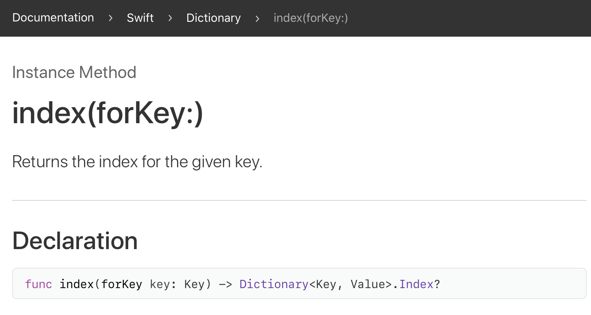

# CHAPTER 08 옵셔널 

옵셔널의 개념은 다음과 같다.

* '변수나 상수 등에 꼭 값이 있다는 것을 보장할 수 없다, 즉 변수 또는 상수의 값이 nil일 수도 있다'는 것을 의미

* 또한 'Optional이 아닌 변수나 상수는 값이 반드시 있다는 것을 보장한다'는 의미

* 어떤 함수의 전달인자로 NULL이 전달되어도 되는지를 문서에 명시하지 않아도 문법적 표현만으로 이를 표현할 수 있다는 장점

  

  위 이미지는 Dictionary에서 키를 이용해 인덱스를 찾는 메서드의 API 문서이다. key 매개변수를 통해 전달되는 인자는 nil이어서는 안되고, 리턴값은 nil일 수도 있음을 직관적으로 알려준다.

* **옵셔널과 옵셔널이 아닌 값은 다른 타입으로 인식**하기 때문에 컴파일할 때 바로 오류를 걸러낼 수도 있음

> NULL을 스위프트에서는 nil로 표기한다.

## 8.1 옵셔널 사용

## 8.2 옵셔널 추출

### 8.2.1 강제 추출

### 8.2.2 옵셔널 바인딩

### 8.2.3 암시적 추출 옵셔널